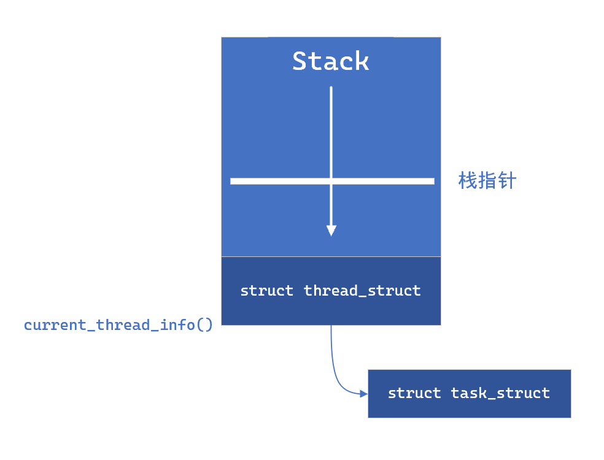

# Chapter 3 - 进程管理

Created by : Mr Dk.

2019 / 10 / 08 22:37

Nanjing, Jiangsu, China

---

## 3.1 进程

进程是处于执行期的程序，包含：

* 代码段
* 打开的文件
* 挂起的信号
* 内核内部数据
* 处理器状态
* 内存地址空间
* 一个或多个执行线程

在 Linux 中，通过 `fork()` 系统调用来复制一个现有进程，创建全新的进程

* 在该调用结束时，返回点在相同的位置上
  * 父进程恢复执行
  * 子进程开始执行

通常，创建新进程是为了执行新的不同程序

调用 `exec()` 函数以创建新的地址空间，并把新程序载入其中

最终，程序通过 `exit()` 系统调用退出执行

* 终结进程并释放资源

父进程通过 `wait4()` 系统调用等待子进程执行完毕

---

## 3.2 进程描述符及任务结构

内核把进程列表存放在称为 __task list__ 的 __双向循环链表__ 中

> 似乎和 Linux 0.12 不一样了？
>
> Linux 0.12 好像是数组喔

链表中的每一项都是 `task_struct` 结构，也就是 PCB

* 在 32-bit 机器上，`task_struct` 大约有 1.7kB
* 但其中的数据可以完整地描述一个正在执行的程序

### 3.2.1 分配进程描述符

在 Linux 2.6 之前的内核中

各进程的 `task_struct` 存放在内核栈的尾端

* 为了让 x86 等寄存器较少的体系结构只需通过栈指针就能计算出其位置

而 Linux 2.6 开始，由 slab 分配器动态生成 `task_struct`

因此只需要在内核栈底或栈顶创建一个新的结构 `struct thread_info`

```c
struct thread_info {
    struct task_struct *task;
    struct exec_domain *exec_domain;
    __u32 flags;
    __u32 status;
    __u32 cpu;
    int preempt_count;
    mm_segment_t addr_limit;
    struct restart_block restart_block;
    void *sysenter_return;
    int uaccess_err;
}
```

其中，`task` 域存放了指向 PCB 的指针



### 3.2.2 进程描述符的存放

内核通过一个唯一的 PID 来标识每个进程

* `pid_t` 类型 (int)，最大默认值为 32768

内核中大部分处理进程的代码都是通过 `task_struct` 进行的

* 通过 `current` 宏查找当前正在执行执行的速度十分重要
* 体系结构不同，该宏的实现方式也不同
  * 有些体系结构可以专门拿出一个寄存器存放当前 `task_struct` 的指针
  * x86 等就只能通过 `thread_info` 间接查找

### 3.2.3 进程状态

* `TASK_RUNNING`
* `TASK_INTERRUPTIBLE`
* `TASK_UNINTERRUPTIBLE`
* `__TASK_TRACED`
* `__TASK_STOPPED`

### 3.2.4 设置当前进程状态

```c
set_task_state(task, state);
// set_current_state(state);
// task->state = state;
```

### 3.2.5 进程上下文

当程序在用户空间调用了系统调用

此时，内核 "代表进程执行" ，并处于进程上下文中

### 3.2.6 进程家族树

Unix 和 Linux 系统的进程之间存在明显的继承关系

所有进程都是 init (PID == 1) 的后代

每个 `task_struct` 都包含一个指向父进程的 parent 指针

还包含一个称为 children 的子进程链表

访问父进程：

```c
struct task_struct *my_parent = current->parent;
```

依次访问子进程：

```c
struct task_struct *task;
struct list_head *list;

list_for_each(list, &current->children) {
    task = list_entry(list, struct task_struct, sibling);
    // ...
}
```

由于进程列表的实现是双向链表，可以随时访问前一个或后一个进程：

* 由 `next_task(task)` 和 `prev_task(task)` 两个宏实现

```c
list_entry(task->tasks.next, struct task_struct, tasks);
list_entry(task->tasks.prev, struct task_struct, tasks);
```

`for_each_process(task)` 宏提供了依次访问整个任务队列的能力：

```c
struct task_struct *task;

for_each_process(task) {
    // task->...
}
```

> 尽量不要重复遍历所有进程
>
> 代价很大

---

## 3.3 进程创建

其它 OS 中使用了 __产生 (spawn)__ 机制来创建进程

* 在新的地址空间里创建进程
* 读入可执行文件
* 开始执行

Unix 将上述步骤分解到 `fork()` 和 `exec()` 两个函数中

* `fork()` 拷贝当前进程，创建一个子进程
  * 区别为 PID (每个进程必须唯一)
  * PPID (父进程进程号)
  * 资源和统计量
* `exec()` 负责读取可执行文件，并载入地址空间开始运行

### 3.3.1 写时拷贝

如果说 `fork()` 直接把所有资源复制给新创建的进程

如果新进程打算立即执行一个新的映像

* 之前的所有拷贝就前功尽弃了

Linux 使用 __copy-on-write__ 技术：

* 推迟，甚至免除数据拷贝
* 内核不复制整个进程地址空间，而是让父进程和子进程共享同一个拷贝 (只读)
* 需要向地址空间写入数据时，数据才会被复制，从各进程拥有各自的拷贝

Unix 强调进程快速执行的能力

* 一般情况下，进程创建后会马上运行一个可执行文件
* 这种优化可以避免拷贝大量根本就不会用的数据

### 3.3.2 fork()

Linux 中通过 `clone()` 系统调用实现 `fork()`

`clone()` 中调用 `do_fork()`，`do_fork()` 调用 `copy_process()` 函数，然后让进程开始运行：

1. 调用 `dup_task_struct()`，为新进程创建内核栈、`thread_info`、`task_struct` (纯复制)
2. 检查，确保进程数目没有超出分配资源的限制
3. 子进程着手使自己与父进程区分 - 对 PCB 进行清零或初始化
4. 设置子进程状态为 `TASK_UNINTERRUPTIBLE` 以保证不会被调度执行
5. 调用 `copy_flags()` 更新 PCB 中的 flags
6. 调用 `alloc_pid()` 为新进程分配 PID
7. 拷贝或共享打开的文件、文件系统信息、信号处理函数、进程地址空间等
8. 扫尾，返回指向子进程的指针

如果 `copy_process()` 函数成功返回，该子进程就会被唤醒

内核会有意选择子进程首先执行

* 因为一般子进程都会立刻调用 `exec()` 函数
* 避免 copy-on-write 的额外开销
* 如果父进程首先执行，有可能会开始向地址空间写入

### 3.3.3 vfork()

除了不拷贝父进程的页表项外，`vfork()` 与 `fork()` 的功能相同

* 子进程作为父进程的一个单独的线程，在其地址空间里运行
* 父进程被阻塞，直到子进程退出或执行 `exec()` 😧 ?
* 子进程不能向地址空间写入

> 似乎不推荐使用？

---

## 3.4 线程在 Linux 中的实现

在同一程序内共享内存地址空间

还可以共享打开的文件和其它资源

Linux 内核中没有线程这个概念

* 把所有线程都当做进程来实现
* 每个线程都有唯一隶属于自己的 PCB
* 只是线程和其它一些进程共享某些资源 (比如地址空间)
* 对于 Linux 来说，线程只是进程间共享资源的手段

### 3.4.1 创建线程

与创建进程类似，只不过在调用 `clone()` 时需要传递一些参数标志

* 指明需要共享的资源

创建线程：

```c
clone(CLONE_VM | CLONE_FS | CLONE_FILES | CLONE_SIGHAND, 0);
```

创建进程 (`fork()`)：

```c
clone(SIGCHLD, 0);
```

`vfork()`：

```c
clone(CLONE_VFORK | CLONE_VM | SIGCHLD, 0);
```

传递给 `clone()` 的参数标志决定了新创建进程的行为，和父子进程之间共享的资源种类

### 3.4.2 内核线程

独立运行在内核空间的标准进程

* 没有独立的地址空间 (因为只在内核空间运行)
* 可以被调度，可以被抢占
* 只能由其它内核线程创建

传递一个函数指针和参数给新进程，并唤醒它即可

---

## 3.5 进程终结

一个进程终结时，内核必须释放它所占有的资源，并通知父进程

进程终结由 `do_exit()` 完成：

1. 设置 PCB 中的 `PF_EXITING`
2. 调用 `del_timer_sync()` 删除任一内核定时器，确保没有定时器在排队
3. 记账？？
4. 调用 `exit_mm()` 释放进程占用的 `mm_struct`；如果没有别的进程共享，就彻底释放
5. 调用 `sem__exit()` 函数
6. 调用 `exit_files()` 和 `exit_fs()`，递减文件描述符、文件系统数据的引用计数；如果引用降为 0，则释放
7. 将 PCB 中的 `exit_code` 设为 `exit()` 提供的退出代码，供父进程检索
8. 调用 `exit_notify()` 向父进程发送信号，给子进程找养父，设置进程状态为 `EXIT_ZOMBIE`
9. 调用调度函数，切换到新进程

`do_exit()` 不会再被调度，因此永远不返回

此时，进程占用的资源都被释放

进程仅占用的内存就是内核栈、`thread_info` 和 `task_struct`

进程还存在的目的就是向父进程提供退出信息

父进程检索到信息后，子进程的剩余资源被释放，归还系统使用

### 3.5.1 删除进程描述符

调用 `do_exit()`，进程处于僵死状态

但系统还是保留其 PID，使系统依然有办法在进程终结后获取其信息

* 清理工作和删除进程描述符的工作是分开执行的
* 父进程获得已终结的子进程的信息后，子进程的 PCB 才被释放

`wait()` 族的函数都是由 `wait4()` 系统调用实现的

* 挂起调用它的进程
* 直到其中的一个子进程退出
* 函数返回子进程的 PID
* 调用该函数提供的指针中，包含子进程退出时的退出码

调用 `release_task()` 释放 PID：

1. 调用 `__exit_signal()` 从任务列表中删除该进程
2. 释放僵死进程所使用的所有剩余资源，进行最终的统计和记录
3. 如果是线程组的最后一个线程，且领头进程已经死掉，则通知僵死领头进程的父进程
4. 回访进程内核栈和 `thread_info` 所占用的页，释放 `task_struct` 占用的 slab 高速缓存

### 3.5.2 孤儿进程造成的进退维谷

若父进程在子进程之前退出，必须有机制保证子进程能找到一个新的父亲

不然成为孤儿的进程在退出时将永远处于僵死状态

* 首先试图找到进程所在线程组内的其它进程
* 若没有，则利用 init 进程

遍历所有子进程，并为它们设置父进程

---

## Summary

进程和线程乱窜一通

不知道是原著就是这样写的，还是翻译的问题

反正在 Linux 里面只有任务 (进程) 这一个概念

只是通过 PCB 中一些字段的共享程度

体现进程和线程的一些差别

这样做似乎也挺好的，很简洁 🤙

---

